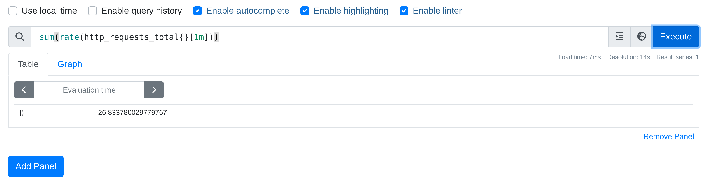

# Integrate Keda with Knative Serving

Knative integrates with HPA via defining the appropriate autoscaling class at the revision level:

```
autoscaling.knative.dev/class: "hpa.autoscaling.knative.dev"
```

Then a special controller called autoscaler-hpa creates a K8s hpa object and sets the service in serve mod.
Since Knative relies on hpa for autoscaling there is no activator involved.
Knative supports HPA for different categories of metrics: cpu, memory and custom metrics.
In order to support hpa with Knative with custom metrics user needs to install Prometheus adapter among others.
See for the details the guide [here](https://gist.github.com/skonto/e9aa295a540c016e868d59702f77e750) on Minikube.

The goal of integrating Knative Serving with Keda here is to delegate the hpa management to Keda and also use what Keda
offers wrt external metrics. There are some benefits with this approach:
- Use Queue Proxy (QP) for handling graceful termination in serve mode
- Knative offers smooth integration with Istio and other ingresses.
- Prometheus adapter is in maintance mode and Keda serves the same role using external metrics instead of custom
- QP offers backpressure capabilities
- OCP offers hpa via KEDA

Note: It is a no-go here to offer the full Keda functionality.

The design of the integration is based on the idea of creating a scaledobject for a ksvc that defines the hpa autoscaling class
and when user enables Keda as a replacement (this is experimental). The ksvc owns the scaledobejct which is removed when ksvc is removed.
The hpa object created is solely managed by Keda and Knative does not interfere.

In order to test the integration the user needs to install Knative Serving, Keda and the autoscaler-keda-hpa component from this repo.

For example on Minikube:

## Install Serving with Keda support for HPA
```
MEMORY=${MEMORY:-40000}
CPUS=${CPUS:-6}

EXTRA_CONFIG="apiserver.enable-admission-plugins=\
LimitRanger,\
NamespaceExists,\
NamespaceLifecycle,\
ResourceQuota,\
ServiceAccount,\
DefaultStorageClass,\
MutatingAdmissionWebhook"

minikube start --driver=kvm2 --memory=$MEMORY --cpus=$CPUS \
  --kubernetes-version=v1.28.0 \
  --disk-size=30g \
  --extra-config="$EXTRA_CONFIG" \
  --extra-config=kubelet.authentication-token-webhook=true

kubectl apply -f https://github.com/knative/serving/releases/download/knative-v1.13.1/serving-crds.yaml
kubectl apply -f https://github.com/knative/serving/releases/download/knative-v1.13.1/serving-core.yaml
kubectl apply -f https://github.com/knative/net-kourier/releases/download/knative-v1.13.0/kourier.yaml

ko apply -f config/

kubectl patch configmap/config-network \
  -n knative-serving \
  --type merge \
  -p '{"data":{"ingress.class":"kourier.ingress.networking.knative.dev"}}'

kubectl patch configmap/config-domain \
      --namespace knative-serving \
      --type merge \
      --patch '{"data":{"example.com":""}}'`
      
kubectl get po -n knative-serving

NAME                                      READY   STATUS    RESTARTS   AGE
activator-58db57894b-ng4s5                1/1     Running   0          27m
autoscaler-79d9fb98c-d79lg                1/1     Running   0          27m
autoscaler-keda-hpa-88cdb8764-kncd6       1/1     Running   0          3m45s
controller-d4645478c-ncqv5                1/1     Running   0          27m
net-kourier-controller-6559c556d7-g8mcg   1/1     Running   0          27m
webhook-dddf6fcff-k99gl                   1/1     Running   0          27m

start minikube tunnel on another terminal

# install prometheus and keda

cat ../values.yaml 
kube-state-metrics:
  metricLabelsAllowlist:
   - pods=[*]
   - deployments=[app.kubernetes.io/name,app.kubernetes.io/component,app.kubernetes.io/instance]
prometheus:
  prometheusSpec:
    serviceMonitorSelectorNilUsesHelmValues: false
    podMonitorSelectorNilUsesHelmValues: false
grafana:
  sidecar:
    dashboards:
      enabled: true
      searchNamespace: ALL

helm install prometheus prometheus-community/kube-prometheus-stack -n default -f values.yaml

helm install keda kedacore/keda --namespace keda --create-namespace

kubectl get po
NAME                                                     READY   STATUS    RESTARTS   AGE
alertmanager-prometheus-kube-prometheus-alertmanager-0   2/2     Running   0          12h
metrics-test-00001-deployment-689dd95d99-4w7x4           2/2     Running   0          24s
metrics-test-00001-deployment-689dd95d99-678ww           2/2     Running   0          6m25s
metrics-test-00001-deployment-689dd95d99-8nssb           2/2     Running   0          24s
metrics-test-00001-deployment-689dd95d99-jdvtb           2/2     Running   0          9s
metrics-test-00001-deployment-689dd95d99-tf6pw           2/2     Running   0          24s
prometheus-grafana-7bd86d696d-r4drj                      3/3     Running   0          12h
prometheus-kube-prometheus-operator-5fb98c84d8-kcm24     1/1     Running   0          12h
prometheus-kube-state-metrics-64cd86f7d-5s2p4            1/1     Running   0          12h
prometheus-prometheus-kube-prometheus-prometheus-0       2/2     Running   0          12h
prometheus-prometheus-node-exporter-q86xv                1/1     Running   0          12h
```

## Run a ksvc with Keda HPA support

Apply the [service.yaml](./service.yaml) and wait for the service to be ready.

```
# Let's create some traffic
for i in {1..1000}; do curl -H "Host: metrics-test.default.example.com " http://192.168.39.92:31000/metrics; done

kubectl get ksvc
NAME           URL                                       LATESTCREATED        LATESTREADY          READY   REASON
metrics-test   http://metrics-test.default.example.com   metrics-test-00001   metrics-test-00001   True    

kubectl get hpa
NAME                 REFERENCE                                  TARGETS       MINPODS   MAXPODS   REPLICAS   AGE
metrics-test-00001   Deployment/metrics-test-00001-deployment   33m/5 (avg)   1         10        1          89s

kubectl get scaledobjects
NAME                 SCALETARGETKIND      SCALETARGETNAME                 MIN   MAX   TRIGGERS     AUTHENTICATION   READY   ACTIVE   FALLBACK   PAUSED    AGE
metrics-test-00001   apps/v1.Deployment   metrics-test-00001-deployment   1     10    prometheus                    True    False    False      Unknown   69s
```

After traffic is send target replicas are increases to 5. The reason is that we have set a trhesold for scaling to be 5 for that metric.
Let's see what Prometheus reports during peak load (`kubectl port-forward -n default svc/prometheus-operated 9090:9090`:



The full configuraiton is shown next:

```
        autoscaling.knative.dev/minScale: "1"
        autoscaling.knative.dev/maxScale: "10"
        autoscaling.knative.dev/target: "5"
        autoscaling.knative.dev/class: "hpa.autoscaling.knative.dev"
        autoscaling.knative.dev/metric: "http_requests_total"
        autoscaling.knative.dev/query: "sum(rate(http_requests_total{}[1m]))"
```

After some cooldown period replicas are terminated back to 1:
```
kubectl get po
NAME                                                     READY   STATUS        RESTARTS   AGE
...
metrics-test-00001-deployment-689dd95d99-4w7x4           1/2     Terminating   0          11m
metrics-test-00001-deployment-689dd95d99-678ww           2/2     Running       0          17m
metrics-test-00001-deployment-689dd95d99-8nssb           1/2     Terminating   0          11m
metrics-test-00001-deployment-689dd95d99-bxl28           1/2     Terminating   0          5m55s
metrics-test-00001-deployment-689dd95d99-jdvtb           1/2     Terminating   0          11m
metrics-test-00001-deployment-689dd95d99-ss8tq           1/2     Terminating   0          5m55s
metrics-test-00001-deployment-689dd95d99-tf6pw           1/2     Terminating   0          11m

```

## Resources

- https://knative.dev/docs/serving/autoscaling/autoscaler-types/#horizontal-pod-autoscaler-hpa
- https://sysdig.com/blog/kubernetes-hpa-prometheus
- https://keda.sh/docs/2.13/concepts/scaling-deployments
- https://stackoverflow.com/questions/69852707/horizontal-pod-autoscaler-hpa-custom-metrics-with-prometheus-adapter-how-are
- https://kubernetes.io/docs/tasks/run-application/horizontal-pod-autoscale
- https://github.com/kubernetes-sigs/prometheus-adapter/blob/master/docs/walkthrough.md
- https://access.redhat.com/documentation/it-it/openshift_container_platform/4.1/html/monitoring/exposing-custom-application-metrics-for-autoscaling
- https://www.ibm.com/docs/en/cloud-private/3.2.0?topic=tp-horizontal-pod-auto-scaling-by-using-custom-metrics